# Polysonix
**Version 1.4.4** | **Author:** Jacques Morel

A single-header polyphonic synthesizer engine.

<details>
<summary>Table of Contents</summary>

- [Overview](#overview)
- [Key Features](#key-features)
- [Design Principles](#design-principles)
- [CPU vs GPU Backends](#cpu-vs-gpu-backends)
- [Concurrency Model](#concurrency-model)
- [Usage](#usage)
- [Quick Start Example](#quick-start-example)
- [Dependencies](#dependencies)
- [Core API Functions](#core-api-functions)
- [Data Structures](#data-structures)
- [Changelog](#changelog)
- [Polysonix Waveform Scripting Language](#polysonix-waveform-scripting-language)
- [License](#license)

</details>

## Overview
polysonix.h is a flexible, stereo polyphonic synthesizer engine designed to be easily embedded into applications. It is built upon the 'polysonix_wave'
expression engine, allowing for dynamically generated waveforms and complex modulation possibilities via a powerful virtual machine.

This library encapsulates all audio processing and state management, deliberately separating the synthesis core from application-specific logic
like UI, input handling, and audio device management.

## Key Features
- **Thread-Safe by Design:** The library is 100% lock-free. Control functions (like `PX_NoteOn`, `PX_SetFilterParam`) can be safely called from any
  UI or main thread, while the `PX_Process` function runs on the dedicated real-time audio thread.
- **Dynamic Waveform Generation:** Leverages the `polysonix_wave` library to execute bytecode expressions for oscillators and LFOs, enabling complex,
  evolving timbres that go far beyond simple wavetables.
- **Rich Synthesis Architecture:**
  - **Polyphony:** Configurable number of voices (up to 16) with intelligent voice stealing.
  - **ADSR Envelopes**: Up to 3 independent ADSR envelopes per voice for modulating various parameters.
  - **LFOs**: Up to 3 independent Low-Frequency Oscillators (LFOs) with their own ADSRs and flexible routing.
  - **Advanced Multi-Mode Filter:** A highly flexible state-variable filter per voice with key tracking, drive, and extensive modulation.
    *   **Modes:** Standard (LP, BP, HP, Notch, Allpass) and Combos (LP+BP, LP+HP, BP+HP).
    *   **Selectable Slopes:**
        *   **6 dB/oct (1-pole):** Gentle, Korg MS-20, Roland SH series, EMS VCS3. Uses **parallel independent filters** for true combo modes (e.g., LP+BP is accurately summed).
        *   **12 dB/oct (2-pole):** Aggressive, Oberheim-style (SVF topology).
        *   **18 dB/oct (3-pole):** Balanced, Roland-style.
        *   **24 dB/oct (4-pole):** Smooth, Moog-style.
  - **Unified Modulation Matrix:** A comprehensive 16-slot modulation matrix allowing standard controllers (Velocity, Aftertouch, Mod Wheel, Pitch Bend, **Key Track**) to modulate nearly any synthesis parameter (Oscillators, Filters, LFOs, ADSRs).
    *   **Response Curves:** Velocity and Aftertouch inputs can be shaped using **Linear, Exponential, Logarithmic, or S-Curve** mappings for expressive control.
  - **Unilegato Mode**: Smooth, monophonic legato with pitch sliding between notes.
  - **Global Post-Filter**: A stereo master filter (LP/HP/BP/etc.) placed after voice mixing for final tone shaping.
- **Stereo Signal Path:** Full stereo output with per-voice panning and LFO pan modulation.
- **Built-in Dynamics:** Includes a per-voice soft-clipper to prevent harsh transients and a master bus lookahead limiter to prevent final output clipping.
- **Oscillator Quality Modes**: Choose between per-sample calculation for quality or interpolated modes for performance.
- **Decoupled Design:** The engine is completely independent of any graphics or windowing library. The host application is responsible for the audio
  callback, making the engine portable to any backend (e.g., Situation, PortAudio, SDL, MiniAudio).

## Design Principles
- **Header-Only:** Designed for easy integration. Simply define `POLYSONIX_IMPLEMENTATION` in one C/C++ file.
- **State Encapsulation:** All synthesizer state is managed within an opaque `PxSynth` handle, ensuring no global state and allowing for multiple
  synth instances if needed.
- **Data-Driven UI:** The library provides a suite of `PX_Get...Info()` functions that return read-only snapshots of the internal state. This allows the host
  application to build a detailed UI without directly accessing internal memory, ensuring a stable and glitch-free API.

## CPU vs GPU Backends

Polysonix offers two distinct backends for waveform generation, allowing developers to choose the best fit for their application's performance profile and platform constraints. By default, the CPU backend is used. To enable the GPU backend, define `POLYSONIX_USE_GPU_WAVE` before including `polysonix.h`.

```mermaid
flowchart TD
    %% Common Frontend
    App[User Application] -->|Define Waveform| Expr["Expression String (e.g. 'sin(x)')"]
    Expr -->|Compile| Compiler[Polysonix Compiler]
    Compiler -->|Generate| Bytecode["Bytecode (Reverse Polish Notation)"]

    %% Split
    Bytecode --> Decision{Backend?}

    %% CPU Path
    Decision -->|"CPU (Default)"| CPU_Mem[Host Memory]
    CPU_Mem -->|Read| CPU_VM["CPU VM\n(Recursive, Computed Gotos)"]
    subgraph CPU_Execution [CPU Audio Thread]
        CPU_VM -->|Synthesize| CPU_Out[Float Audio Buffer]
    end

    %% GPU Path
    Decision -->|"GPU (Optional)"| Serializer["Serializer\n(Packs structs for std430)"]
    Serializer -->|Upload| SSBO[GPU SSBO Buffer]
    SSBO -->|Bindless Access| GPU_VM["GPU VM\n(Iterative, Explicit Stack)"]
    subgraph GPU_Execution [OpenGL Compute Shader]
        GPU_VM -->|Synthesize| GPU_Out[Float Buffer / Texture]
    end

    %% Comparison styling
    classDef cpu fill:#3f0f3f,stroke:#6f1f6f,stroke-width:2px;
    classDef gpu fill:#0f3f3f,stroke:#1f6f6f,stroke-width:2px;
    class CPU_VM,CPU_Execution,CPU_Out cpu;
    class GPU_VM,GPU_Execution,GPU_Out,SSBO gpu;
```



### CPU Backend (`polysonix_wave_cpu.h`)
The default engine. It is a highly optimized, single-header C library designed for real-time audio generation on the CPU.

*   **Zero Dependencies:** Pure C99, compiles anywhere.
*   **Low Latency:** Instant response to parameter changes, ideal for real-time playing.
*   **Optimized VM:** Uses "Computed Gotos" (on GCC/Clang) and register caching to minimize overhead.
*   **Recursive:** Natural handling of complex nested expressions.

### GPU Backend (`polysonix_wave_gpu.h` + `polysonix_wave.comp`)
An optional backend that offloads synthesis to the graphics card using Compute Shaders. It leverages modern OpenGL 4.6 features for maximum efficiency.

*   **Technology Stack:** Built on **OpenGL 4.6** Compute Shaders.
*   **Bindless Architecture:** Uses **Bindless Descriptors** (via `GL_EXT_buffer_reference2`) to access memory directly, avoiding the overhead of traditional binding slots.
*   **SSBO Storage:** All bytecode, constants, and parameters are managed in **Shader Storage Buffer Objects (SSBOs)** using `GL_EXT_scalar_block_layout` for seamless C-struct compatibility.
*   **Massive Parallelism:** Capable of generating thousands of samples simultaneously.
*   **Feature Parity:** The GLSL shader implements the exact same VM logic (via a non-recursive state machine) as the CPU version.

### Comparative Performance Analysis

The choice between CPU and GPU backends depends largely on the specific requirements of your application, particularly the trade-off between **latency** and **throughput**.

| Feature | CPU Backend | GPU Backend |
| :--- | :--- | :--- |
| **Ideal Use Case** | Real-time interactive synthesis (games, instruments), low-latency audio playback | Offline rendering, audio visualization, massive additive synthesis, texture generation |
| **Latency** | **Negligible** (< 1ms). Direct memory access allows for instant reaction to user input. | **Moderate** (~2-10ms). Requires PCIe transfer, driver dispatch overhead, and read-back synchronization. |
| **Throughput** | **High**. Limited by CPU core count and clock speed. Best for serial processing of independent voices. | **Massive**. Capable of calculating thousands of samples in parallel. Scaling is nearly linear until VRAM bandwidth is saturated. |
| **Complexity Limit** | High complexity (nested loops) can stall the audio thread and cause dropouts. | Can handle extremely complex math and heavy `sigma()` loops without blocking the main CPU thread. |
| **Architecture** | Recursive Stack VM (Uses System Stack) | Iterative State Machine VM (Uses Explicit Stack) |
| **Key Tech** | C99, Computed Gotos | OpenGL 4.6, Bindless SSBOs |

#### Throughput vs. Latency: The Crossover Point

The CPU backend is faster for small-to-medium workloads due to zero dispatch overhead. The GPU backend becomes superior when the sheer volume of calculations (samples * complexity) justifies the fixed cost of communicating with the graphics card.

```text
Performance (Samples/Sec)
      ^
      |                                     / (GPU Backend)
      |                                   /
      |                                 /
      |                               /   <-- Massive Parallelism Scaling
      |                             /
      |---------------------------/-------- (CPU Backend Limit)
      |                         /
      |                       /
      |                     /  <-- Crossover Point (~10k+ concurrent samples)
      |                   /
      |_________________/
      0               Load (Complexity * Polyphony) ->
```

#### Detailed Benchmarks

**CPU Backend:**
Aggressively optimized using computed gotos and register caching.
- **Average Execution Time:** ~100 ns per sample (Apple Silicon M3).
- **Standard Waves:** ~85 ns.
- **Complex/Sigma:** ~200 ns.
- *See [PERFORMANCE_REPORT.md](PERFORMANCE_REPORT.md) for full details.*

**GPU Backend:**
- **Execution Time:** Variable, but effectively "free" for the main CPU thread.
- **Dispatch Cost:** Fixed overhead of ~10-50µs per dispatch depending on driver/OS.
- **Throughput:** Can generate 48kHz audio for 1000+ voices simultaneously in real-time on mid-range hardware.

## Concurrency Model
This library is **THREAD-SAFE**. It uses a lock-free producer/consumer model.
- **Producer (Main/UI Thread):** Calls to control functions like `PX_NoteOn` or `PX_SetFilterParam` do not modify the synth state directly. Instead,
    they place a "command" into a lock-free queue. This is a very fast operation that will not block the UI.
- **Consumer (Audio Thread):** At the beginning of each `PX_Process` call, the audio thread quickly drains the command queue,
    applying all pending state changes in a safe, sequential manner. This ensures the synth's state is perfectly consistent
    for the entire duration of the audio block processing.
- **UI Data:** `Get` functions read from a snapshot of the synth's state, which is safely updated by the audio thread after it finishes processing a block.
    This prevents data races and ensures the UI displays a stable, coherent view of the synthesizer's actual sounding parameters.

## Usage
To use this library, do this in **one** C or C++ file:
```c
#define POLYSONIX_IMPLEMENTATION
#include "polysonix.h"
```
All other files can simply `#include "polysonix.h"`.

1.  Define `POLYSONIX_IMPLEMENTATION` in one C/C++ file before including this header.
2.  Include `polysonix.h` in any other files that need to interact with the synthesizer.
3.  Create a `PxConfig` struct and populate it with your desired settings (sample rate, voices, etc.).
4.  Call `PX_Create()` with your config to get a `PxSynth` instance.
5.  In your audio callback, call `PX_Process()` to generate audio samples.
6.  Use `PX_NoteOn()` and `PX_NoteOff()` from your main thread to control notes.
7.  When finished, call `PX_Destroy()` to free all resources.

## Quick Start Example
```c
// main.c
#include "situation.h" // Your audio framework
#define POLYSONIX_IMPLEMENTATION
#include "polysonix.h"

// Global synth instance
static PxSynth* synth = NULL;

// Audio callback wrapper
static uint64_t AudioCallback(void* user_data, void* buffer, uint64_t bytes_to_read) {
    if (!synth) return 0;

    // Calculate frames (assuming stereo float)
    uint64_t frames = bytes_to_read / (sizeof(float) * 2);

    // Generate float audio directly into the output buffer
    // Polysonix outputs interleaved float samples (-1.0 to 1.0)
    PX_Process(synth, (float*)buffer, (int)frames);

    return bytes_to_read;
}

int main() {
    // 1. Init Situation and dependencies
    SituationInitInfo info = { .window_width = 800, .window_height = 600, .window_title = "Synth" };
    SituationInit(0, NULL, &info);

    // Initialize Polysonix Waveform Engine
    init_polysonix_lfsr_tables();
    initialize_bytecode_cache();

    // 2. Configure and create the synth
    PxConfig config = { .num_voices=8, .sample_rate=48000 };
    synth = PX_Create(&config);

    // 3. Start Audio Stream
    SituationAudioFormat fmt = { .sample_rate = 48000, .channels = 2, .bit_depth = 32 };
    SituationSound stream;
    SituationLoadSoundFromStream(AudioCallback, NULL, NULL, &fmt, true, &stream);
    SituationPlayLoadedSound(&stream);

    // 4. Main loop
    while (!SituationWindowShouldClose()) {
        SituationPollInputEvents();

        if (SituationIsKeyPressed(SIT_KEY_C)) PX_NoteOn(synth, 60, 0, SIT_KEY_C, 1.0f);
        if (SituationIsKeyReleased(SIT_KEY_C)) PX_NoteOff(synth, SIT_KEY_C);

        // ... render ...
        SituationEndFrame();
    }

    // 5. Clean up
    SituationStopLoadedSound(&stream);
    SituationUnloadSound(&stream);
    PX_Destroy(synth);
    free_bytecode_cache();
    free_polysonix_lfsr_tables();
    SituationShutdown();
}
```

## Dependencies
- **Required:** `polysonix_wave_cpu.h` (or `polysonix_wave_gpu.h`) and its implementation must be available and linked. The host application must call `init_polysonix_lfsr_tables()` and `initialize_bytecode_cache()`
  before creating a synth instance and is responsible for compiling the waveform expressions used by the synth.

## Core API Functions

The API is designed to be simple and thread-safe.

- `PX_Create(const PxConfig* config)`: Creates and initializes a synthesizer instance.
- `PX_Destroy(PxSynth* s)`: Destroys a synthesizer instance and frees all associated memory.
- `PX_Process(PxSynth* s, float* stereo_buffer, int num_frames)`: Processes a block of audio.
- `PX_NoteOn(PxSynth* s, int midi_note, int wave_idx, int key_id)`: Triggers a new note.
- `PX_NoteOff(PxSynth* s, int key_id)`: Releases a note.

The library also provides a comprehensive set of `PX_Set...` and `PX_Get...` functions for controlling all aspects of the synthesizer, including:

- Voice ADSR parameters
- LFO parameters and routing
- Filter parameters (Per-Voice and Global)
- **Velocity/Aftertouch Curves**
- Global settings like pan and limiter
- Unilegato settings

Additionally, there are several `PX_Get...Info()` functions that provide read-only snapshots of the internal state for UI display.

## Data Structures & Enums

### Enums
Enums are used extensively in `polysonix.h` to define modes, targets, and parameters.

*   `PxFilterMode`: `PX_FILTER_MODE_OFF`, `PX_FILTER_MODE_LP`, `PX_FILTER_MODE_BP`, `PX_FILTER_MODE_HP`, `PX_FILTER_MODE_LP_BP`, `PX_FILTER_MODE_LP_HP`, `PX_FILTER_MODE_BP_HP`, `PX_FILTER_MODE_NOTCH`, `PX_FILTER_MODE_ALLPASS`.
*   `PxADSRDestination`: `PX_ADSR_DEST_NONE`, `PX_ADSR_DEST_PARAM1` (Mod A), `PX_ADSR_DEST_PARAM2` (Mod B), `PX_ADSR_DEST_PARAM3` (Mod C), `PX_ADSR_DEST_AMP`, `PX_ADSR_DEST_FREQUENCY`, `PX_ADSR_DEST_LFO0_OUTPUT_LEVEL`, `PX_ADSR_DEST_LFO1_OUTPUT_LEVEL`, `PX_ADSR_DEST_LFO2_OUTPUT_LEVEL`, `PX_ADSR_DEST_FILTER_CUTOFF`, `PX_ADSR_DEST_FILTER_ENV_INPUT`, `PX_ADSR_DEST_FILTER_RESONANCE`.
*   `PxLFODestination`: `PX_LFO_DEST_NONE`, `PX_LFO_DEST_PARAM1`, `PX_LFO_DEST_PARAM2`, `PX_LFO_DEST_PARAM3`, `PX_LFO_DEST_FILTER_CUTOFF`, `PX_LFO_DEST_AMP`, `PX_LFO_DEST_PITCH`, `PX_LFO_DEST_PAN`.
*   `PxADSRParamType`: `PX_ADSR_PARAM_ATTACK`, `PX_ADSR_PARAM_DECAY`, `PX_ADSR_PARAM_SUSTAIN`, `PX_ADSR_PARAM_RELEASE`.
*   `PxFilterParamType`: `PX_FILTER_PARAM_CUTOFF`, `PX_FILTER_PARAM_RESONANCE`, `PX_FILTER_PARAM_ENV_AMOUNT`, `PX_FILTER_PARAM_DRIVE`, `PX_FILTER_PARAM_KEYTRACK`, `PX_FILTER_PARAM_POLES`.
*   `PxModSource`: `PX_MOD_SRC_VELOCITY`, `PX_MOD_SRC_AFTERTOUCH`, `PX_MOD_SRC_MODWHEEL` (CC #1), `PX_MOD_SRC_PITCHBEND`, `PX_MOD_SRC_POLY_AFTERTOUCH`, `PX_MOD_SRC_KEY_TRACK`.
*   `PxCurveType`: `PX_CURVE_LINEAR` (default), `PX_CURVE_EXP`, `PX_CURVE_LOG`, `PX_CURVE_S`.
*   `PxOscillatorUpdateMode`: `PX_OSC_UPDATE_MODE_PER_SAMPLE`, `PX_OSC_UPDATE_MODE_FIXED_RATE`, `PX_OSC_UPDATE_MODE_NYQUIST`.

### Core Structures

**`PxConfig`**
Configuration settings passed to `PX_Create`.
```c
typedef struct PxConfig {
    int num_voices;                     // Max simultaneous voices (e.g., 16)
    int num_lfos;                       // Global LFOs (e.g., 3)
    int num_voice_adsrs;                // ADSRs per voice (e.g., 3)
    float sample_rate;                  // Sample rate in Hz (e.g., 44100.0f)
    int samples_per_lfo_update;         // Audio samples between LFO updates
    float lfo_update_interval_ms;       // LFO update interval in ms
    PxOscillatorUpdateMode osc_update_mode; // Quality vs Performance mode
    float osc_fixed_update_rate_hz;     // Rate for FIXED_RATE mode
    float nyquist_precision_multiplier; // Multiplier for NYQUIST mode
    bool use_gpu;                       // Enable GPU acceleration (if supported)
} PxConfig;
```

**`PxVoiceInfo`**
Read-only snapshot of a voice's real-time state (via `PX_GetVoiceInfo`).
```c
typedef struct PxVoiceInfo {
    bool active;                // Is the voice currently playing/releasing?
    int midi_note;              // MIDI note number
    float frequency;            // Current frequency in Hz
    float pan_position;         // Stereo pan (-1.0 to 1.0)
    float effective_amplitude;  // Final amplitude
    PxADSRState adsr_states[3]; // Current state (IDLE, ATTACK, etc.) of ADSRs
    float adsr_levels[3];       // Current output level of ADSRs
    float lfo_outputs[3];       // Current output value of LFOs
} PxVoiceInfo;
```

**`PxLFOInfo`**
Read-only snapshot of an LFO's state (via `PX_GetLFOInfo`).
```c
typedef struct PxLFOInfo {
    bool enabled;           // Is LFO active?
    int wave_idx;           // Waveform index
    float frequency;        // Rate in Hz
    bool reset_on_key_on;   // Does phase reset on Note On?
    bool adsr_enabled;      // Is internal ADSR active?
    float adsr_level;       // Current internal ADSR level
    float phase;            // Current phase (0.0 to 1.0)
    float raw_output;       // Raw waveform output (-1.0 to 1.0)
    float final_output;     // Final output after ADSR shaping
} PxLFOInfo;
```

**`PxLimiterInfo`**
Read-only snapshot of the limiter (via `PX_GetLimiterInfo`).
```c
typedef struct PxLimiterInfo {
    bool initialized;           // Is limiter running?
    float gain_reduction_db;    // Current reduction in dB (non-negative)
} PxLimiterInfo;
```

**Other Structures**
*   `PxSynth`: An opaque handle representing the synthesizer instance.
*   `PxPatch`: A struct that holds the editable parameters of the sound (internal use, modified via API).
*   `PxWaveInfo`: Information about a specific waveform (name, compilation status).
*   `PxADSRParams`: Configuration for an ADSR envelope (attack, decay, sustain, release, enabled).
*   `PxLFOParams`: Configuration for an LFO (waveform, frequency, etc.).

## Changelog
For the full history of changes, please see [updatelog.md](updatelog.md).

## Polysonix Waveform Scripting Language
The Polysonix Waveform Scripting Language is a domain-specific language for defining mathematical expressions that generate audio waveforms in the Polysonix synthesizer. Expressions are stored as strings, tokenized, parsed into an abstract syntax tree (AST), compiled into bytecode, and executed by a virtual machine (VM) for real-time audio synthesis.

### Language Structure
The language follows a C-like mathematical expression grammar. Expressions are composed of:

- **Literals**: Floating-point numbers (e.g., `1.0`, `0.5`).
- **Variables**: `x`, `FREQUENCY`, `MOD_A`, `MOD_B`, `MOD_C`, `RAND_OFFSET`, and loop variables (e.g., `k`).
- **Constants**: `PI`, `TWO_PI`, `PI_OVER_2`, `THREE_PI_OVER_2`, `E`, LFSR type constants.
- **Functions**: Mathematical, utility, and LFSR functions (e.g., `sin`, `sigma`, `lfsr_val`).
- **Operators**: Arithmetic, unary, comparison, logical, and ternary.
- **Grouping**: Parentheses `()` for precedence and function arguments.
- **Commas**: Separate function arguments.

### Operand Symbols
The language supports the following operators:

- **Arithmetic (Binary)**: `+`, `-`, `*`, `/`, `%`
- **Unary**: `+`, `-`, `!`
- **Comparison**: `<`, `>`, `<=`, `>=`, `==`, `!=`
- **Logical**: `&&`, `||`, `^`
- **Ternary**: `?`, `:`
- **Other**: `()`, `,`

### Variables and Parameters
- `x`: Phase, typically normalized from 0 to 2*PI over one wave cycle.
- `FREQUENCY`: Current note frequency in Hertz (Hz).
- `MOD_A`, `MOD_B`, `MOD_C`: Modulation parameters, typically ranging from -1.0 to 1.0.
- `RAND_OFFSET`: A per-wave random value, typically from 0.0 to 1.0, constant for the duration of one wave generation.
- `k`: Default loop variable name for the `sigma()` summation function.

### Constants
- `PI`, `TWO_PI`, `PI_OVER_2`, `THREE_PI_OVER_2`, `E`
- **LFSR Types**: `LFSR_4BIT` through `LFSR_17BIT`, `LFSR_GALOIS`, `LFSR_FIBONACCI`

### Functions
- **Trigonometric**: `sin`, `cos`, `tan`, `asin`, `acos`, `atan`
- **Numeric**: `abs`, `tanh`, `exp`, `log`, `log10`, `floor`, `ceil`, `min`, `max`, `sqrt`, `pow`, `rand`
- **Summation**: `sigma(k, start, end, step, expr)`
- **LFSR**: `lfsr_val`, `lfsr_noise`, `lfsr_clock`

### Examples

**Basic Sawtooth Wave**
```
1.0 - (x / PI)
```

**Pulse Width Modulation (PWM)**
```
x < (PI + MOD_A * PI) ? 1.0 : -1.0
```

**Additive Synthesis with Sigma**
```
sigma(k, 1.0, 8.0, 1.0, sin(x*k)/k)
```

**LFSR-based Noise**
```
lfsr_noise(LFSR_8BIT, 2.0 + MOD_B)
```

## License
polysonix.h is licensed under the MIT License. See the [LICENSE](LICENSE) file for details.
